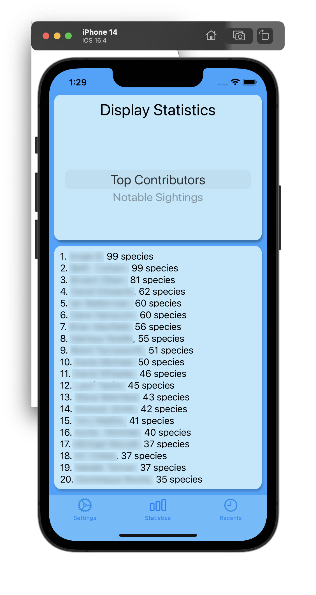
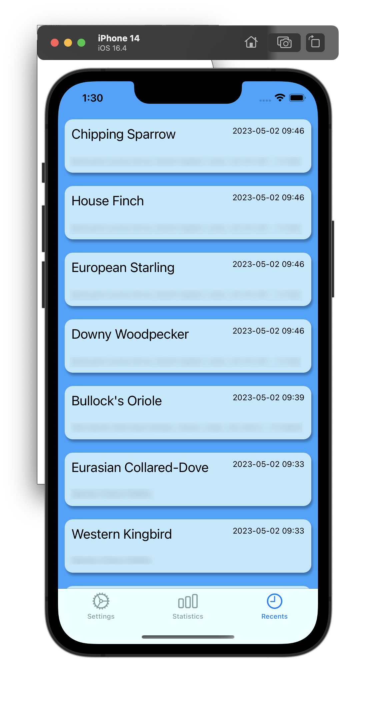
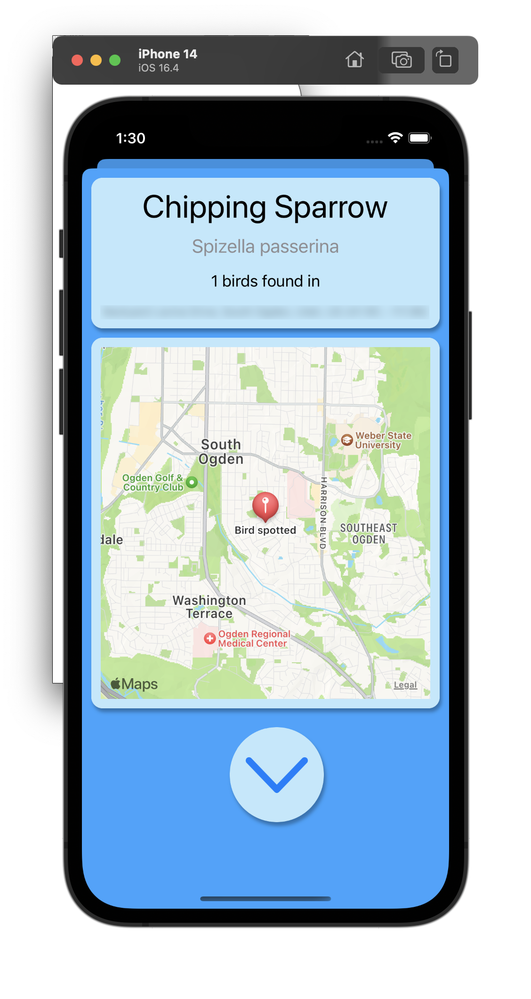

# Bird Finder

This is an iOS app I created for an assignment in my iOS class. It retrieves data from the eBird API (https://ebird.org/home) and displays sightings and birds for Utah. I've blurred some lines in the screenshot for privacy as it does display names and sighting locations.

## Features

It can display the list of top contributors for the region, as well as notable sightings.

You can view a list of recent sightings for the region, as well as view the details and location for the sighting.

